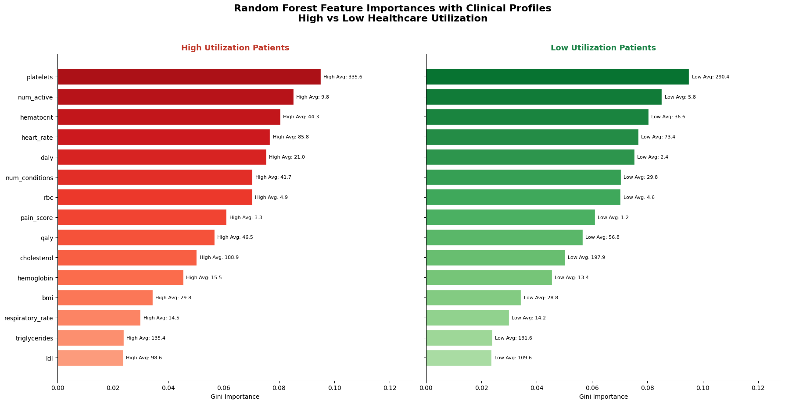

# High-Risk Cancer Care: Using Machine Learning to Identify What Drives Healthcare Resource Use

## Hook

Can we predict which cancer patients will require the most healthcare resources—and understand exactly why? Cancer care is not only about treatment, but also about continuous monitoring, repeated hospital visits, and complex clinical decision-making over time. This project explores how machine learning can be used to anticipate which patients are likely to place higher demand on healthcare systems, while also uncovering the clinical reasons behind that demand.

---

## Problem Statement

Cancer patients differ widely in how frequently they interact with healthcare systems, depending on disease severity, comorbid conditions, and overall clinical complexity. However, hospitals often lack early and interpretable indicators that can help identify which patients will require higher levels of care and resource allocation. This makes it difficult to proactively plan staffing, optimize clinical workflows, and manage long-term treatment burden in oncology care.

---

## Solution Description

This project addresses this challenge by applying machine learning to longitudinal cancer patient records in order to classify patients into high and low healthcare utilization groups. Beyond simple prediction, the model is designed to provide interpretability by identifying which clinical features most strongly influence resource use. Using structured data such as lab results, vital signs, demographics, and encounter histories, the system transforms complex electronic health records into actionable insights. These insights can support healthcare providers in better anticipating patient needs, improving care planning, and allocating resources more efficiently across cancer care pathways.

---

## Chart

## What drives healthcare resource utilization?

The Random Forest model highlights which clinical features are most influential in distinguishing between high and low healthcare utilization among cancer patients. Feature importance is measured using Gini importance, where longer bars indicate stronger predictive influence. Clinical averages across patient groups further support interpretation, allowing model outputs to be connected back to real-world patient characteristics. The analysis shows that patients with higher utilization tend to have a greater number of active conditions, as well as elevated physiological indicators such as heart rate, RBC, platelets, and hematocrit levels. Additionally, quality-of-life measures such as DALY and QALY play a strong role in differentiating patient groups. In contrast, features like HDL and respiratory rate contribute less to prediction, indicating weaker association with healthcare utilization patterns.

---

## Closing Insight

This work demonstrates that machine learning can move beyond simply predicting healthcare utilization to explaining it in clinically meaningful terms. By identifying the underlying drivers of resource intensity, this approach enables healthcare systems to better understand not only which cancer patients are likely to require more care, but also why those needs arise. This supports more informed decision-making, more efficient resource allocation, and ultimately more proactive and targeted cancer care management.